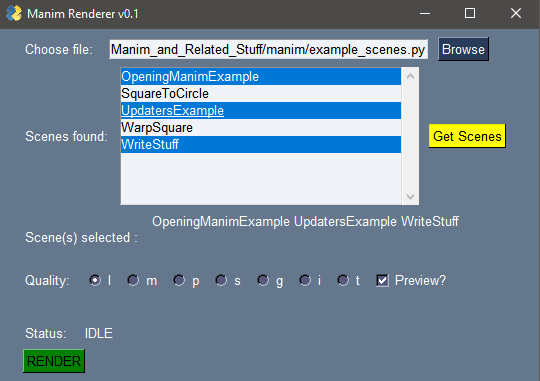

# Manim Renderer
> **NOTE**: This repository is not being actively maintained anymore. The CLI interface for manim has improved quite a bit in the past year or two, and now we have even more exciting things such as [manim-sideview](https://github.com/Rickaym/Manim-Sideview) that are worth checking out, thus I'm archiving manim-renderer. 

Normally, to render a [manim](https://github.com/3b1b/manim) scene, one uses the following command:

`[py | python | python3 -m] manim /path/to/file.py <scene_name(s)> [options] `

This can become tedious when rendering many scenes and after making some changes. With this tool however, you can select your file, scene(s) and options, and render at the click of a button.

Example:

## Instructions
* Place this file in the same directory as your manim installation or change the current working directory using `os.chdir("\path\to\manim")`
* Run the GUI - `py gui.py` (assuming you've changed the cwd to your manim installation)
* Select file, scene(s) and options and click 'RENDER'.
* Monitor the rendering in your terminal.

## Note
This has only been tested on Windows 10 and may need to be modified for cross-platform usage.

## Acknowledgements
This application was made using [PySimpleGUI](https://github.com/PySimpleGUI/PySimpleGUI). I'd also like to express my gratitude to [3Blue1Brown](https://github.com/3b1b) for making his amazing animation library free for all of us.

Hope you find this thing useful!
